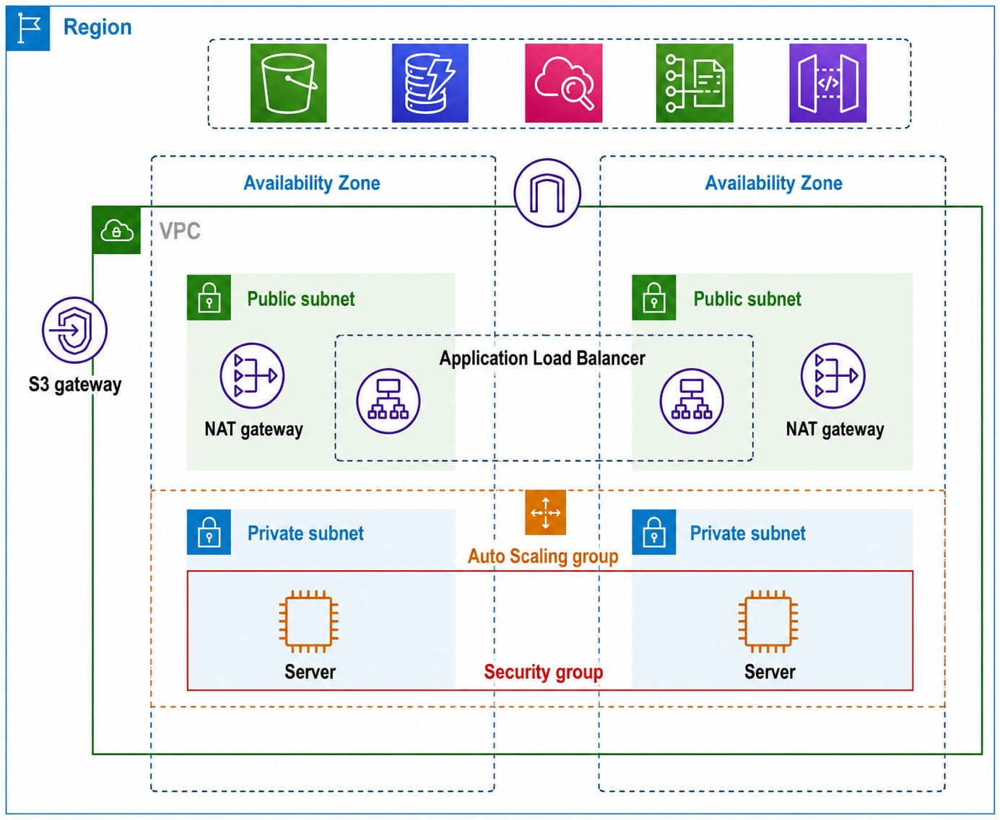
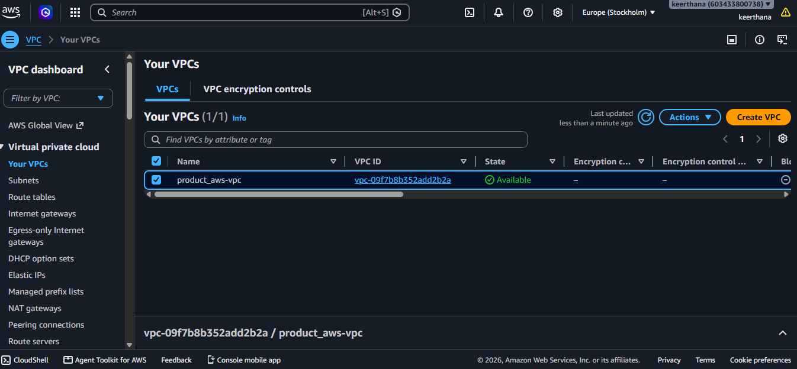
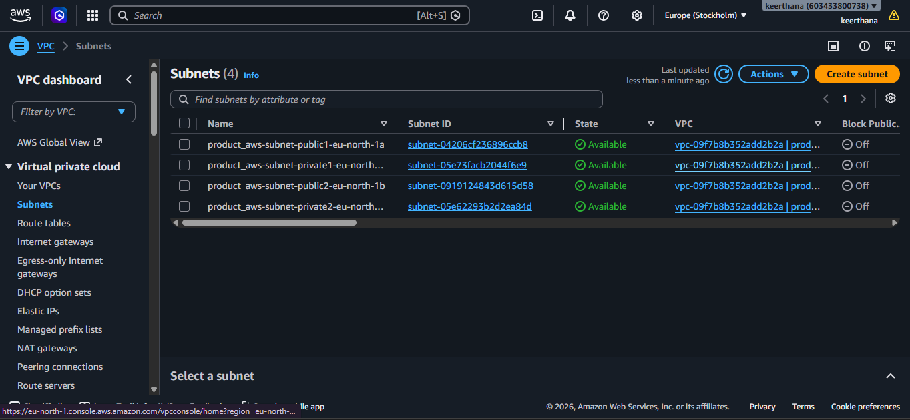
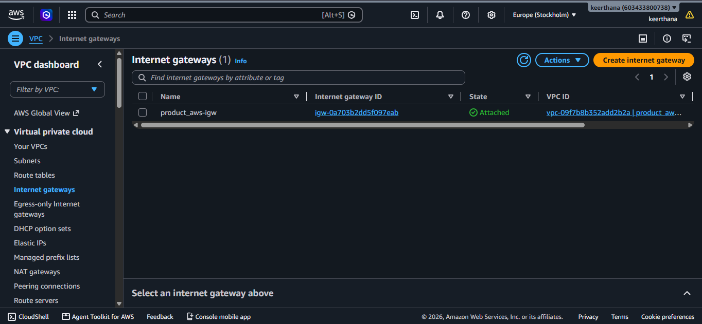
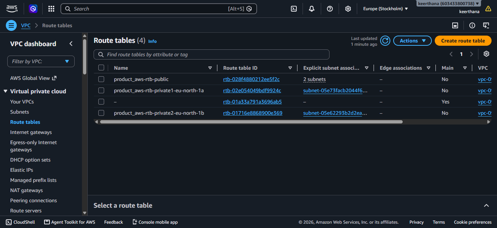
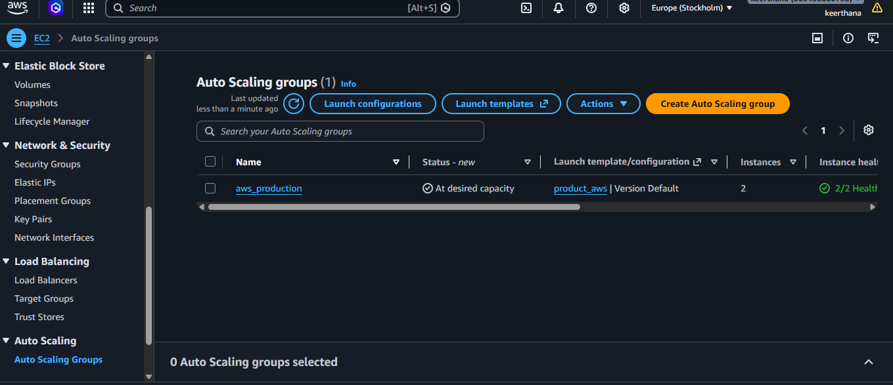
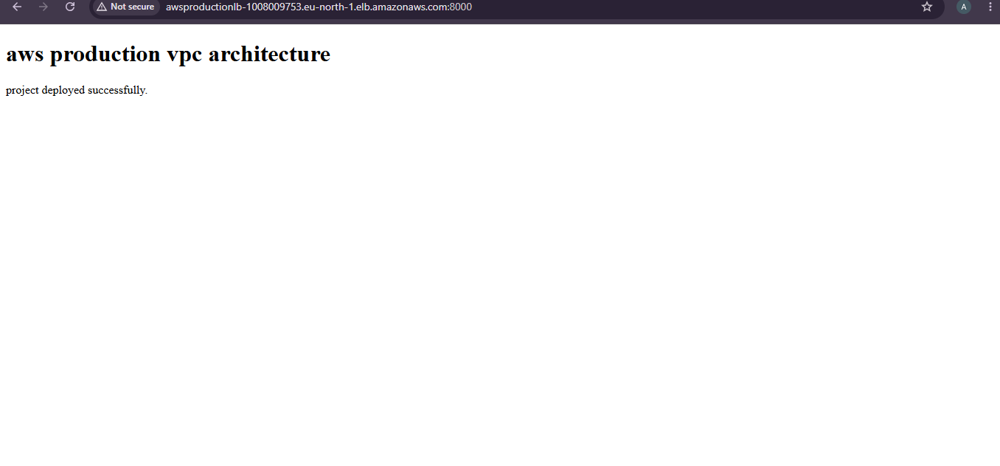

# AWS VPC with Public and Private Subnets

## Project Overview

This project demonstrates a highly available and secure AWS infrastructure deployed across two Availability Zones. The architecture uses both public and private subnets. Public subnets host the Application Load Balancer (ALB) and NAT Gateways, while private subnets host the EC2 application servers. The EC2 instances are managed by an Auto Scaling Group (ASG) to ensure high availability and automatic scaling based on demand.

Servers in the private subnets receive traffic only through the Application Load Balancer and access the internet securely using the NAT Gateway. An Amazon S3 Gateway Endpoint enables private access to Amazon S3 without traversing the public internet.

---

## AWS Services Used

- Amazon VPC
- Public & Private Subnets
- Internet Gateway (IGW)
- NAT Gateway
- Application Load Balancer (ALB)
- Amazon EC2
- Auto Scaling Group (ASG)
- Security Groups
- Route Tables
- Amazon S3
- VPC Gateway Endpoint (S3)
- Elastic IP

---

## Project Architecture

---

## Implementation Steps

1. Create a VPC with a custom CIDR block.
2. Create two public subnets and two private subnets across two Availability Zones.
3. Attach an Internet Gateway to the VPC.
4. Configure public and private route tables.
5. Associate the subnets with their respective route tables.
6. Create NAT Gateways in the public subnets.
7. Add default routes from private subnets to the NAT Gateways.
8. Create an Amazon S3 Gateway Endpoint.
9. Configure Security Groups.
10. Launch EC2 instances.
11. Create an AMI and Launch Template.
12. Configure an Auto Scaling Group.
13. Create an Application Load Balancer.
14. Configure the Target Group.
15. Test High Availability and Auto Scaling.

---

## Project Screenshots

### 1. VPC

### 2. Subnets

### 3. Internet Gateway

### 4. NAT Gateway

### 5. Route Tables

### 6. Security Groups

### 7. EC2 Instance

### 8. Application Load Balancer

### 9. Auto Scaling Group

### 10. HTML Web Page

---

## Learning Outcomes

After completing this project, I was able to:

- Design a secure AWS network using Amazon VPC.
- Configure public and private subnets.
- Understand Internet Gateway and NAT Gateway.
- Deploy EC2 instances in private subnets.
- Configure an Application Load Balancer.
- Implement Auto Scaling for high availability.
- Configure Security Groups and Route Tables.
- Enable private access to Amazon S3 using a Gateway Endpoint.
- Build a production-style, highly available AWS architecture.
- Gain practical hands-on experience with AWS networking and compute services.
